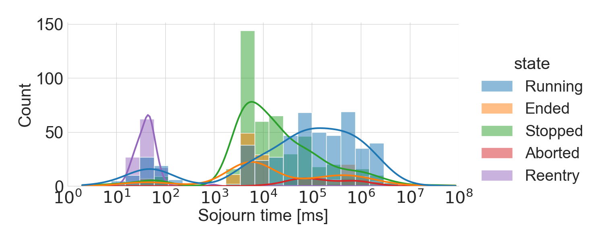

# A Generative Approach for Production-Aware Industrial Network Traffic Modeling
Pretrained generated models for production-aware industrial network traffic modeling

## Contribution
we investigate the network traffic data generated from a laser cutting machine deployed in a Trumpf factory in Germany. We evaluate the data and model the network traffic as a production state dependent stochastic process in two steps: first, we model the production process as a multi-state semi Markov process, then we learn the conditional distributions of the production state dependent packet interarrival time and packet size with different generative models, including variational autoencoder (VAE), conditional variational autoencoder (CVAE), and generative adversarial network (GAN).

In this repository, we publish the pretrained models for the industrial network traffic. 

 `The model is under an external release process within the company. We will upload as soon as they are approved to be published.`

## Dependencies
We have used the following software versions:
- python (3.8)
  - numpy (1.22)
  - scikit-learn (1.0.2)
  - pandas (1.3.5)
  - pytorch (1.10.1)
  
## Launching scripts
The traffic generation can be launched through the `gen_traffic.py` script.

## License
This work is licensed under the Creative Commons Attribution-NonCommercial 4.0 International License.
© 2022 Nokia
